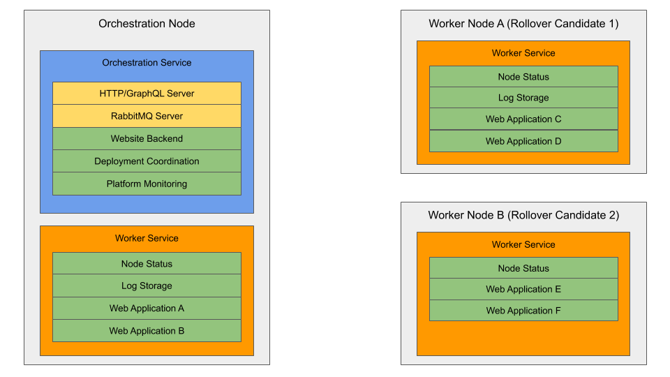

# Kraken Project Architecture

## Overview

The Kraken App Deployment Platform is a loose collection of devices all running the Kraken agent. Each device is given a specific set of tasks to perform in order to provide the full set of platform functionalities.

The Kraken agent is written in Rust. It provides the backend worker and orchestrator features to support the platform, which are covered in more detail in [Executors](##Executors). The ways the devices communicate with each other are covered in [Communication](##Communication). Finally, the specifics of how deployments are handled are covered in [Deployments](##Deployments).

The frontend experience is a React+AntDesign project, which lives [here](https://github.com/ethanshry/Kraken-UI).

## Installaton and Updates

NOTE: This process is not currently supported by the platform (WIP).

The installer will create a bash script that runs on computer boot. This installation will check for the newest stable version of the platform, download it if possible, and start it up.

The intention would be to use a simple `curl [installer_script] | bash` command to get the project installed and running.

The installer will create a local file to record the most recently downloaded commit, which is how it will detect whether the current version of the project is out of date or not. Then it is a simple matter of installing required dependencies, and downloading/compiling the project's zip. Because the commit will be validated every time the system reboots, updates will be handled automatically in this way.

## Project Initialization

The Kraken Agent performs a specific set of steps to initialize and execute. This process follows the following rough outline:

- Scan the network for an orchestration node. If one exists, then start in worker mode. Otherwise start in orchestrator mode.
- If we are in Orchestrator mode, setup orchestration features (i.e. RabbitMQ, REST/GQL server, etc)
- Setup worker features (RabbitMQ queues, etc)

Then the execution loop is incredibly simple:

- If we are an orchestrator, perform an iteration of orchestration features
- Perform an iteration of worker features

If we can boil down this process to its simplest form, it would look something like this:

```rust
// Note code is in no way valid, and should just be viewed as psuedocode with a rust flair
async fn main(){

    let node_mode = match network::find_orchestrator_on_lan().await {
        Some(_) => {
            NodeMode::WORKER
        }
        None => {
            NodeMode::ORCHESTRATOR
        }
    };

    if node_mode == NodeMode::ORCHESTRATOR {

        let mut orchestrator = platform_executor::orchestration_executor::OrchestrationExecutor::new();
        orchestrator.setup(&mut node).await

        let mut worker = platform_executor::worker_executor::WorkerExecutor::new();
        worker.setup(&mut node).await;

    } else {

        let mut worker = platform_executor::worker_executor::WorkerExecutor::new();
        worker.setup(&mut node).await;

    }

    loop {

        if node_mode == NodeMode::ORCHESTRATOR {
            orchestrator.execute(&mut node).await
        }

        worker.execute(&mut node).await
    }
}
```

However, this `loop` process is not entirely linear. RabbitMQ messages are handled and consumed asyncronously, as well as HTTP and GQL requests for the orchestrator, so typically the work an orchestrator or worker has to do involves checking to see what has changed in the state of their local databses/deployments, and reacting to them.

## Executors

There are a variety of features which a Kraken agent must perform. Broadly speaking, these fall into two categories: features required of a Worker (like managing deployments) and features required by an orchestrator (storing information about the state of all nodes on the platform).

The `NodeMode` struct defines which type of Node we are working as. Different NodeModes have a different set of `Executors` which fall under their perview, and these `Executors` are what perform the work required by different roles



Therefore you can think of every device as having at least a single Executor. Every device has a `WorkerExecutor`, which does the following:

- Reports their system statistics
- Manages any requests for local deployments (including updates, teardowns, and faliures)
- Forwards logs of local deployments to the orchestrator
- Ensures they have a valid connection to a platform in the case of orchestrator or critical service faliure
- Serves as a rollover canidate in the case of orchestrator faliure. This might include being a backup device for platform data

One node on the network, the orchestrator, has an additional executor, the `OrchestrationExecutor`, which:

- Provides an HTTP server to allow other agents to discover the platform, and provide the platform UI experience
- Provides a GQL server to provide data for the UI experience
- Maintains logs for all deployments
- Coordinates requests from the UI experience (i.e. deployment, teardown, update), and distribute those requests to workers
- Monitors the platform for deployment/node faliure
- Ensures critical platform services exist to allow the platform to function (i.e. a RabbitMQ instance)

These functions are broken down in their respective files in the `crate::platform_executor` module. Each role adheres to the following trait

```rust
/// Defines the interface to be used by all executors on a device
/// The executor will have setup called once, to instantiate the executor, and then will have execute called repeatedly so long as the executor is alive.
#[async_trait]
pub trait Executor {
    /// Is called once to set up this node
    async fn setup(&mut self, node: &mut GenericNode) -> Result<(), SetupFaliure>;
    /// Is called repeatedly after setup has terminated
    async fn execute(&mut self, node: &mut GenericNode) -> Result<(), ExecutionFaliure>;
    // ...
}
```

This allows for the simple execution process- any function group will have setup called on it once, and then execute repeatedly so long as the application continues to run.

## Communication

Communication between entities on the platform is multi-modal.


The first communication within the platform is the node-node communication. When a new agent is initialized, it must scan the LAN for an http server to determine if an orchestrator already exists (i.e. it should attach itself to an exsiting network, or create a new one). Additionally the orchestrator might ping a worker to determine if a deployment has been succesful. Outside of this basic communication, all other node-node communication happens via a RabbitMQ instance. Nodes set up a variety of queues to recieve work from the orchestrator, and report on their status.

All communication with RabbitMQ is handled via the `crate::rabbit::RabbitBroker` struct, which is itself a wrapper around featurs from the `lapin` crate. `RabbitBroker` handles establishing connections with the RabbitMQ service. The `RabbitMessage` trait handles the data sent over RabbitMQ more directly.

```rust
pub trait RabbitMessage<T> {
    fn build_message(&self) -> Vec<u8>;
    fn deconstruct_message(packet_data: &Vec<u8>) -> (String, T);
    async fn send(&self, channel: &lapin::Channel, tag: &str) -> bool
}
```

Essentially, implementors of this Trait must define a build/deconstruct interface for their messages, which allows tighter constraint on the message schema. In general, we restrict the types of messages in a single queue to a single type, which means that consumers of that queue know what type of message to expect and therefore how to decode it.

An overview of the channels defined can be found below.

| Channel ID | Defined By   | Message Struct     | Description                                                                                   |
| ---------- | ------------ | ------------------ | --------------------------------------------------------------------------------------------- |
| Sysinfo    | Orchestrator | SysinfoMessage     | Carries information about the status of devices on the network                                |
| Deployment | Orchestrator | DeploymentMessage  | Carries information about a deployment (either in build, while active, or after deletion)     |
| Log        | Orchestrator | LogMessage         | Carries the log information from a deployment (currently only while the deployment is active) |
| SystemId   | Worker       | WorkRequestMessage | Allows the orchestrator to request work from a worker                                         |

Additionally, the Orchestration node provides a GQL/REST interface for the UI. The REST interface is dead simple:

| Route               | Description                                                 |
| ------------------- | ----------------------------------------------------------- |
| /                   | Redirect to /index.html                                     |
| /ping               | Allows health check of Orchestrator                         |
| /graphql, /graphiql | Standard /graphql /graphiql functionality, powers UI data   |
| /log/<log_id>       | Provides access to deployment log files                     |
| /<path..>           | Provides access to UI bundle files, and other images/assets |

The schema for the GQL interface can be examined in depth when the platform is running via the `/graphiql` endpoint.

## Platform Services

This is also a work in progress, see [#47](https://github.com/ethanshry/Kraken/issues/47).

## Platform Resilliancy

At this point, there is no platform resilliancy. In fact, should anything bad happen, it is highly likely the whole thing will just fall down like a tower of cards.

Ideally, this will be fixed in the next iteration, and faliures will lead to re-deployments and rollover processes.

## Deployments

Deployments to the platform are requested via the GraphQL interface `create_deployment` mutation (typically via the Kraken-UI). When a request comes in, it creates an entry in the Orchestrator's database with the `ApplicationStatus::DeploymentRequested` status. The next time `execute` is called for our Orchestrator, it will see this requested deployment and look for the least-loaded worker node to deploy to. The orchestrator will then send a `WorkRequestMessage` of `WorkRequestType::RequestDeployment` to that worker. This will then add an entry to that worker's `work_requests` queue. When `execute` is next called for that worker, it will see that request, and start creating the application container. Deployments are handled by Docker, to allow for platform-agnostic deployment. Dockerfiles for the platform are stored in the `CARGO_MANIFEST_DIR/dockerfiles` folder.
