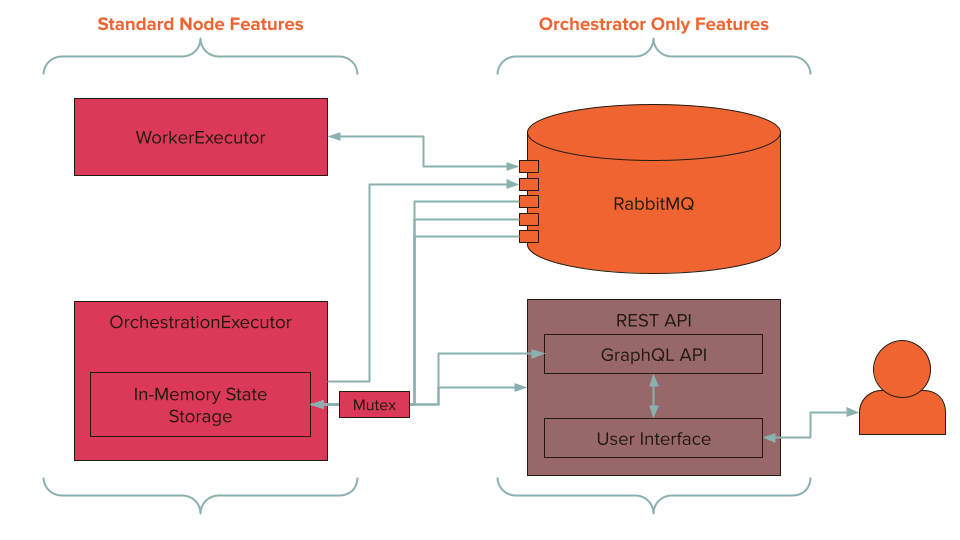

# A LAN-Based Distributed Development Sandbox

By Ethan Shry

## Abstract

TODO: Blah blah blah

We first discuss the motivation and aims of the project.

We then discuss the capabilities and usage of the project

We then discuss the underlying technologies/systems which make the project possible

## Motivation

Over the past several years, the proliferation of cloud services like Amazon Web Services (AWS), Microsoft Azure, and Google Cloud Platform (GCP) have lowered the barrier to the development and deployment of web-based applications. Many companies have migrated their entire operations away from private data centers, and entirely rely on cloud offerings. Despite this, the cost of these solutions remains high for hobbyist developers. Below is a breakdown of the cost of hardware costs for dedicated, non-preemptible servers on the top three cloud platforms:

| Instance Name       | Specs           | Price (dollars/month) |
| ------------------- | --------------- | --------------------- |
| EC2 t2.micro (AWS)  | 1 CPUs, 1GB RAM | $8.47                 |
| A1 v2 (Azure)       | 1 CPUs, 2GB RAM | $26.28                |
| EC2 t2.large (AWS)  | 2 CPUs, 8GB RAM | $67.75                |
| A4 v2 (Azure)       | 4 CPUs, 8GB RAM | $116.07               |
| e2-standard-2 (GCP) | 2 CPUs, 8GB RAM | $48.91                |

While there are cheaper instances available if you opt for premptible services, or reserve hardware for an extended period of time, each platform has tens or hundreds of possible server configurations, which can make simply determining what you can get by with a challenge. Beyond the determination of appropriate server capacity, users of cloud platforms also need to develop the knowledge to make use of these servers- often requiring the management of Linux servers, firewall or security group settings, and the protection of cloud platform credentials. While these skills might be valuable in the workforce, often they add unnecesarry complexity to a project, especially during the early stages of development when the focus could be on the development of project features.

## Goals

This project aims to achieve three things:

- Reduce or eliminate the cost to deploy projects (at a LAN level)
- Reduce or eliminate the knowledge required to perform these deployments
- Be a testbed for the development of my knowlege in new areas of computer science

TODO: there is something to be said here about the types of deployments we are aiming to support (i.e. we are trying to support the hosting of websites or APIs locally so you can test them on different devices, or show them to friends, or power hobbyist projects, NOT support production scale deployments).

TODO: I'm not quite sure how to structure this section, something about why rust, something about pre-existing hardware, idk

### A Note on Scope of Work and Project Direction

While cost and complexity form the backbone of the motivation for the project, the primary motivation for its design and development revolve around the desire to develop knowledge in new areas of computer science. While it would have been trivial for me to use a group of technologies I was more comfortable with, or ignore reliability for what is fundamentally a development (and therefore not in need of stability) environment, I chose to focus on these areas of development. Though decisions made as a result of this third goal do not impact the first two in terms of the platform, it did significantly reduce the set of features I would have otherwise been able to build into the platform, and did inform some of the design decisions I made for the platform. I will endevor to make a note of these points shortcomings in the project as we cover its main systems.

## Platform Overview

The Kraken App Deployment Platform is a collection of devices all running the Kraken agent. The platform is made up of a single Orchestration node, and 0+ Worker nodes (although technically all nodes are both Orchestrators and Workers, see [Executors](###Executors) for more details). Users of the platform are able to access a web interface which allows them to monitor all devices (nodes) which are running the agent. From this interface, they can also request the deployment of an application to the platform via a Github Url. This will trigger the platform's orchestrator to validate the deployment, and select a worker to handle the deployment. Users can then use the interface to monitor their deployment- accessing information like deployment status, resource usage statistics, application logs, and request updates or destruction of a deployment.

TODO platform architecture diagram

### Platform Capabilities

The Platform supports the following deployment types:

- NodeJS Applications
- Python 3.6 Applications
- Static HTML Site Deployments

That being said, the platform is highly extensible. To add additional deployment types, all that is required is a dockerfile and a minor (potentially single line) code addition. Additionally, because the platform uses docker under the hood to manage deployments, you can also ship a custom dockerfile with your application, and run whatever deployment you want.

Due to the fact that it is designed to support primarilly API deployments, the platform will simply expose a single internal docker port externally to your machine. Ephemeral Tasks are technically supported, though their behavior has not been extensively validated. Other deployment types (databases, complex deployments utilizing docker networking features, etc) are not officially supported, though may be possible via the custom Dockerfile feature.

## Usage

This section will cover the important pieces needed to use the platform.

### Requirements

The platform relies on only a few external dependencies.

| Dependency     | Reason/Usage                                                                                                                                                                                                                                                                       |
| -------------- | ---------------------------------------------------------------------------------------------------------------------------------------------------------------------------------------------------------------------------------------------------------------------------------- |
| Linux (Debian) | The platform was only tested on Debian (Ubuntu 20.04, 18.04, Raspbian Buster) distributions, and all installation/development/usage instructions are designed and tested under those assumptions. While other operating systems might function, they are not officially supported. |
| Git            | Used to download new versions of the platform, as well as deployment files                                                                                                                                                                                                         |
| Rustup/Cargo   | Used to compile the platform                                                                                                                                                                                                                                                       |
| Docker         | Used to manage deployments                                                                                                                                                                                                                                                         |
| NodeJS/npm     | Used to compile the platform interface                                                                                                                                                                                                                                             |
| systemctl      | Used to configure the auto-update and run-on-boot features of the platform, included by default with all tested Debian distributions                                                                                                                                               |

All of the required packages will be installed as part of the installation path you follow, see [Installation](###Installation) for more information.

### Installation

The goal of the installation process is to be as simple as possible for users. Therefore, it only takes the execution of a single script to get a system set up for use by the app deployment platform.

The platform can be installed to your device through one of three installation scripts:

| File                 | Purpose                                                                                                                                                                                      |
| -------------------- | -------------------------------------------------------------------------------------------------------------------------------------------------------------------------------------------- |
| installer-compile.sh | Installation for devices which can compile the project easily (i.e. laptop/desktop computers).                                                                                               |
| installer-dev.sh     | Installation and setup of dependencies for devices which will be developing the project (kraken peer dependencies). This will not set up the platform as a system service to be run on boot. |
| installer-pi.sh      | Installation for devices which cannot compile the project easily (i.e. raspberry pi)                                                                                                         |

Running an installer performs the following sequence of tasks:

```bash
# installation of relevant peer dependencies
# configuration of those peer dependencies (i.e. configuration of docker user groups)
# setup of kraken directory, and either compilation of the platform or downloading a compiled executable
# establishment of the kraken.service, which will run a script to auto-update and auto-run the platform on boot
```

We provide two different installation options (the `installer-compile` and `installer-pi`) since compiling a rust project (or this project in particualr) requires significant computing resources, as well as openssl, which does not come built in with Raspbian. As a result, prior to distributing a pre-compiled binary with openssl built in, compiling on a Raspberry Pi 3 B+ took upwards of an hour with active cooling, as well as additional configuration to get openssl installed. Now, Raspberry Pis simply need to download a ~20MB binary. See [Compilation](###Compilation) for more information about how Kraken achieves low-effort cross compilation.

The most detailed and up to date information about installation is available [here](./Installation.md).

### Application Onboarding

Getting your application onboarded to the platform requires only a few simple steps. First, you must make sure you have a running version of the platform on your LAN. You can either follow the [installation steps above](###Installation), or simply clone the project and run the platform temporarily.

Then you must configure your application to be run on the platform. To do this, you must simply create a `shipwreck.toml` file in the root of your repository, in the branch you want to be deployed to the platform. An example might look like the following:

```toml
[app]
name="scapenode"
version="1.0.0"
author="Ethan Shry"
endpoint="https://github.com/ethanshry/scapenode"

[config]
port=7211
lang="node"
run="npm start"
```

Components of the `app` section describe metadata about the application, while fields of the `config` section describe important configuration aspects of your deployment. More details about these fields are available on the `info` screen in the platform interface, and the config field format is implemented in the `crate::deployment::shipwreck` module.

From there, you simply need to access the `deployments` tab of the interface, and select the appropriate URL and branch for your deployment. This should enable the `Create Deployment` button, from which you can spin up your deployment.


## Platform/Program Systems

This section will cover the main systems involved in the platform. The figure below outlines the major responsibilities of a node on a platform.


As you can see, each node has two different `Executors` running at any given time. These are oulined more in the [Executors](###Executors) section, however an executor is a way to differentiate groupd of functionality. There are effectively two types of nodes on the platform- a single orchestrator, and many workers. Their responsibilities are covered in the [Workers](###Workers), [Orchestrators](###Orchestrators), and [Orchestration Rollover Candidates](###Orchestration-Rollover-Candidates) sections below.

The way the various pieces of the platform communicate with each other is outlined in [Communication](###Communication).

### Program Initialization + Main Program Loop

The platform initialization and execution is relatively straightforward, due to the use of executors. The setup process follows the following rough outline:

- Scan the LAN for an orchestration node by looking for an open REST endpoint at the Kraken REST API port number. If one exists, then start in worker mode. Otherwise start in orchestrator mode.
- Establish other relevant platform requirements (finding or creating a guid, figuring out the rabbitMQ address, determining a baseline rollover priority)
- Setup the orchestrator and worker executors

Then the execution loop is incredibly simple:

- Call `execute` on our `OrchestrationExecutor`, and handle an error if it occurs
- Call `execute` on our `WorkerExecutor`, and handle an error if it occurs

If we boil down this process to its simplest form, it looks something like this:

```rust

async fn main() -> Result<(), ()> {

    // Figure out if we are a worker or orchestrator by trying to find a platform to attach to
    let node_mode = match find_orchestrator_on_lan().await {
        Some(ip) => NodeMode::ORCHESTRATOR,
        None => NodeMode::WORKER
    };

    // other setup steps
    // ...

    // Setup our executors
    let mut orchestrator = OrchestrationExecutor::new();
    orchestrator.setup().await;
    let mut worker = WorkerExecutor::new();
    worker.setup().await;

    // The main execution loop
    loop {
        // Each node has an orchestration executor and a worker executor
        match orchestrator.execute(&mut node).await {
            Ok(_) => {}
            Err(faliure) => match faliure {
                // handle orchestrator faliures
                // this might involve orchestration rollover
                // ...
            },
        };
        match worker.execute(&mut node).await {
            Ok(_) => {}
            Err() => {
                // handle various forms of ExecutionFaliure
                // ...
            }
        };
        sleep(Duration::from_millis(500));
    }
}

```

You will note the use of a sleep at the end of this execution loop. This is simply to prevent the platform from performing hundreds of unnecesarry iterations if it has no work to do. While delta timing here might be preferred in a production environment and needed to gaurantee as quick as possible response times, in my experience this method has very little impact on platform responsiveness, and is marginally simpler, so I didn't worry about it.

### Executors

There are a variety of tasks a `Node` on the platform must perform. These broadly fall into two categories: features required of a `Worker`, and features required of an `Orchestrator`. While the specific responsibilities for each role will be outlined in the [Workers](###Workers), [Orchestrators](###Orchestrators), and [Orchestration Rollover Candidates](###Orchestration-Rollover-Candidates) sections, all of these roles follow the same `Executor` trait.

An executor is simply a struct which implements two methods: setup and execute. `setup` is called once to set up the node, and `execute` will then be called repeatedly until the executor crashes or the program terminates. Both of these methods also accept a `GenericNode`, which allows different executors to share common data, and return the same `SetupFaliure` and `ExecutionFaliure` responses across executors. This allows us to isolate different funcionality to specific executors, while having a unified way to interface with them. As a result of this design, it would be trivial to add another executor to extend the functionality of our `Node` without impacting existing executors, or running a `Node` which is only an `Orchestrator` or `Worker` without being both.

```rust
pub trait Executor {
    /// Is called once to set up this node
    async fn setup(&mut self, node: &mut GenericNode) -> Result<(), SetupFaliure>;
    /// Is called repeatedly after setup has terminated
    async fn execute(&mut self, node: &mut GenericNode) -> Result<(), ExecutionFaliure>;
}

pub struct GenericNode {
    pub broker: Option<RabbitBroker>,
    pub system_id: String,
    pub rabbit_addr: String,
    pub orchestrator_addr: String,
}
```

### Workers

A Worker, or more precisely a `WorkerExecutor`, handles all tasks in relation to actually deploying and monitoring applications. This includes almost all of the interface between the platform and the Docker Engine.

```rust
pub struct WorkerExecutor {
    work_queue_consumer: Option<lapin::Consumer>,
    deployments: std::collections::LinkedList<DeploymentInfo>,
    tasks: Vec<Task>,
}
```

A `WorkerExecutor` is relatively simple- it has a handle to a RabbitMQ Queue, `work_queue_consumer`, over which is recieves `WorkRequestMessages`. It has a list of deployments it monitors, `deployments`, and it has a handle to other tasks it is monitoring, `tasks`.

When setup is called on the `WorkerExecutor`, it connects to RabbitMQ, begins broadcasting the Node status to the orchestrator, and establishes the consumer for the `work_queue_consumer`.

On a call to `execute`, the worker does two things: first, it checks to see if it has an outstanding `WorkRequestMessage`. This message is passed to the worker via the RabbitMQ consumer and is extensible, but currently only supports two request types: `RequestDeployment` and `CancelDeployment`. The request contains all the necesarry information for the Worker to perform the requested task. Finally, the `Worker` looks at all its active deployments and broadcasts any relevant log messages to the relevant RabbitMQ queue. More information about how the `RequestDeployment` process works can be found in [Deployments](###Deployments)

Below you can find a simplified version of the code which implements the `Executor` trait for the `WorkerExecutor`.

```rust

impl Executor for WorkerExecutor {

    async fn setup(..) -> Result<(), SetupFaliure> {
        // connect to rabbitMQ
        connect_to_rabbit_instance(&node.rabbit_addr).await;

        // create a task to monitor this Node's stats
        WorkerExecutor::get_publish_node_system_stats_task(node).await

        // establish consumer for the worker's work queue
        broker.consume_queue_incr(&node.system_id).await
    }

    async fn execute(..) -> Result<(), ExecutionFaliure> {
        // if we have a WorkRequestMessage, then execute it
        if let Some(data) = try_fetch_consumer_item(&mut self.work_queue_consumer).await {
            let (_, task) = WorkRequestMessage::deconstruct_message(&data);

            match task.request_type {
                RequestDeployment => {
                    handle_deployment(&task).await;
                }
                CancelDeployment => {
                    kill_deployment(&task).await;
                }
            }
        }

        for (index, d) in self.deployments.iter_mut().enumerate() {

            let logs = docker.get_logs(&d.deployment_id).await;
            if !logs.is_empty() {
                let mut msg = LogMessage::new(&d.deployment_id, &logs.join());
                msg.send().await;
            }

            let status = docker.get_container_status(&d.deployment_id).await
            let mut msg = DeploymentMessage::new(&d.deployment_id, status);
            msg.send().await;
        }
    }
}

```

### Orchestrators

An Orchestrator, or more precisely an `OrchestratorExecutor`, is more complex. It handles all tasks in relation to coordinating deployments- this includes recieving requests for deployments/cancellations from the REST API, validating they are deployable, and distributing requests to nodes. Additionally the orchestrator is responsible for deploying and respoinding to requests from the REST and GraphQL APIs, deploying the RabbitMQ instance, storing application logs, and otherwise managing the platform.

```rust
pub struct OrchestrationExecutor {
    /// A handle to the rocket.rs http server task
    api_server: Option<tokio::task::JoinHandle<()>>,
    /// A reference to the Database containing information about the platform
    pub db_ref: Arc<Mutex<Database>>,
    /// The rank of this executor for rollover. 0 implies this is the active orchestrator, None implies none is assigned.
    /// Otherwise is treated as lowest number is highest priority
    pub rollover_priority: Option<u8>,
    pub queue_consumers: Vec<Task>,
}
```

The most important piece of the `OrchestrationExecutor` is the `db_ref`. This is a thread-safe reference to a `Database`. See more information in [In-Memory State Storage](###In-Memory-State-Storage) and [Communication](###Communication) for how this works, but the general idea is the `api_server` has a reference to the database, and so is able to create requests there for deployments. The Orchestrator is then able to read the `Database` record for Nodes and Deployments, and take any actions necesarry based on their states.

When setup is called on the `OrchestrationExecutor`, it fetches the most recent version of the `Kraken-UI` interface and compiles it, spins up a `RabbitMQ` server, connects to it, and sets up threads to consume the various status queues. Finally it establishes the REST and GraphQL APIs which serve the UI and Platform Data.

On a call to `execute`, the Orchestrator does two things: first, it checks all available deployment statuses to see if there is any action to be taken. For example, a deployment might be asking to be updated, destroyed, or created. The Orchestrator will take any action necesarry for those deployments. Then, the Orchestrator will check all the `Nodes` it knows about to ensure they have recently reported a status. If they haven't, it will re-deploy any deployments owned by that Node, and otherwise remove it from the platform.

Below you can find a simplified version of the code which implements the `Executor` trait for the `OrchestrationExecutor`.

```rust

impl Executor for OrchestrationExecutor {
    async fn setup(..) -> Result<(), SetupFaliure> {

        // Setup RabbmitMQ server and Fetch and compile Kraken-UI
        let ui = OrchestrationExecutor::fetch_ui();
        let rabbit = OrchestrationExecutor::deploy_rabbit_instance();

        Self::connect_to_rabbit_instance().await;

        // Consume RabbitMQ Queues
        // Queue for information about Node statuses
        self.get_sysinfo_consumer();

        // Queue for information about Deployment statuses
        self.get_deployment_consumer();

        // Queue for recieving Deployment Logs
        self.get_log_consumer();

        OrchestrationExecutor::create_api_server();
    }

    async fn execute(..) -> Result<(), ExecutionFaliure> {

        let deployments = db.get_deployments();

        for mut deployment in d {
            match deployment.status.0 {
                DeploymentRequested => {
                    // Look for free nodes to distribute tasks to
                    deployment.update_status(ValidatingDeploymentData);
                    if let Err(_) = validate_deployment(..) {
                        continue
                    }
                    deployment.update_status(DelegatingDeployment);

                    // Pick the best node to handle the deployment
                    // ..

                    deployment.update_status(Deploying);
                    // Send work to curr_node
                    // Create and send a WorkRequestType::RequestDeployment
                    // For the appropriate node
                    // ..
                }
                UpdateRequested => {
                    let commit = github_api::get_tail_commit(..);
                    if commit != deployment.commit {
                        // Creates and sends a WorkRequestMessage::CancelDeployment
                        // followed by a WorkRequestType::RequestDeployment
                        // ..
                    }
                }
                DestructionRequested => {
                    // Creates and sends a WorkRequestMessage::CancelDeployment
                    // ..
                }
            }
        }

        for n in db.get_nodes() {
            // Check to see if a node hasn't been heard from in awhile
            // If so, then re-deploy all it's owned deployments and remove
            // All node information from the DB
            // ..
        }
    }
}

```

### Orchestration Rollover Candidates

Though technically this role falls under the `OrchestrationExecutor` umbrella, an Orchestration Rollover Candidate is worth talking about separately. These are `OrchestrationExecutors` which have a `rollover_priority != Some(0)`. In these cases, the `setup` for the executor will do nothing. In `execute`, the orchestrator is only responsible for checking to see that it can communicate with the primary orchestrator. If the candidate is the primary candidate (i.e. the first rollover node), then it will also backup the database and log data from the primary orchestrator.

```rust

impl Executor for OrchestrationExecutor {
    async fn setup(..) -> Result<(), SetupFaliure> {
        // We are not the primary orchestrator, so no setup is necesarry
    }

    async fn execute(..) -> Result<(), ExecutionFaliure> {

        let priority = get_rollover_priority(..).await;
        match priority {
            None => {
                // No priority means we have an issue with the orchestration communication
                // Here we attempt some recovery
                // ..
            }
            Some(_) => {
                if self.rollover_priority == Some(1) {
                    // We are the primary rollover canidate, so we need to be backing up
                    // data from the primary
                    let database_data = get_primary_orchestrator_db_data(..);
                    db.clear();
                    db.backup(database_data)

                    for log in logs_to_backup {
                        backup_log_file(&log).await;
                    }
                }
                return Ok(());
            }
        }
    }
}

```

### Communication

The most complicated portion of this project is figuring out how all the different pieces of the platform communicate with each other. The below diagram covers the different pieces of the platform, and where they are communicating.



The first thing to note is the way external users interface with the platform. The User Interface only communicates with the platform via the GraphQL API. This communication method was choses so as to maximuze flexibility in development- by using GraphQL, it is very easy to modify the schema of the requests on-the-fly, which sped up development significantly, and allows for future expansibility. The GraphQL API (which really rests on top of a standard REST API) has a thread-safe reference to the In-Memory State Storage (or the `Database`) that is owned by the `OrchestrationExecutor`. All the data to power the API comes from this database, and any user requests which are made to the platform will be created in this database. The only exception to this is the delivery of UI files (and application log files), which come from the REST API.

This theme- the ownership of a thread-safe reference to the `OrchestrationExecutor`'s database, is common across all other parts of the platform as well. The `OrchestrationExecutor` only monitors the database to determine which tasks to perform. The different RabbitMQ queue consumers the database own all have a reference to this database as well, so any inbound to the `OrchestrationExecutor` comes through the database. The only exception to this is in Orchestration Rollover Candidates, which monitor a route on the REST API to ensure the primary orchestrator is still active, and to recieve their backup data.

When an `OrchestrationExecutor` has a need to communicate with a `WorkerExecutor` (in either direction), that communication will travel through the RabbitMQ instance. This includes the following messages:

| Channel ID   | Direction | Message Struct     | Description                                                                                   |
| ------------ | --------- | ------------------ | --------------------------------------------------------------------------------------------- |
| Sysinfo      | W -> O    | SysinfoMessage     | Carries information about the status of devices on the network                                |
| Deployment   | W -> O    | DeploymentMessage  | Carries information about a deployment (either in build, while active, or after deletion)     |
| Log          | W -> O    | LogMessage         | Carries the log information from a deployment (currently only while the deployment is active) |
| \<SystemId\> | O -> W    | WorkRequestMessage | Allows the orchestrator to request work from a worker                                         |

### In-Memory State Storage

There has been a fair bit of discussion about this already, however the primary `OrchestrationExecutor`'s `Database` is the single source of truth for the platform.

```rust
pub struct Database {
    /// Information about the deployments the orchestrator is managing
    deployments: HashMap<String, Deployment>,
    /// Information about the nodes the orchestrator is managing
    nodes: HashMap<String, Node>,
    /// Information about the platform
    orchestrator: Orchestrator,
}
```

Anything which wants to communicate inbound to the `OrchestrationExecutor` (i.e. RabbitMQ Consumers and the REST/GraphQL APIs) has a thread-safe reference to this database. This model is actually very similiar to the implementation of the [mini-redis](https://github.com/tokio-rs/mini-redis) crate.

TODO do I have more to say about this?

### Rollover

### Deployments

### User Interface

### Compilation

### REST/GraphQL API

### Limitations

TODO remove???

## Artifacts

| Artifact Name                 | Artifact Use                         | Link                                                                                                                     |
| ----------------------------- | ------------------------------------ | ------------------------------------------------------------------------------------------------------------------------ |
| Kraken                        | Platform/Backend Code                | [https://github.com/ethanshry/Kraken](https://github.com/ethanshry/Kraken)                                               |
| Kraken-UI                     | UI/Frontend Code                     | [https://github.com/ethanshry/Kraken-UI](https://github.com/ethanshry/Kraken-UI)                                         |
| Kraken-Orchestrator-Discovery | Orchestrator IP Discovery Tool       | [https://github.com/ethanshry/Kraken-Orchestrator-Discovery](https://github.com/ethanshry/Kraken-Orchestrator-Discovery) |
| Kraken-Utils                  | Rust Crate to support Kraken Backend | [https://github.com/ethanshry/Kraken-Utils](https://github.com/ethanshry/Kraken-Utils)                                   |

## Acknowledgements

TODO flush this out:

Ryan Levick, Jon Gjenset, r/rust, Bill Siever
